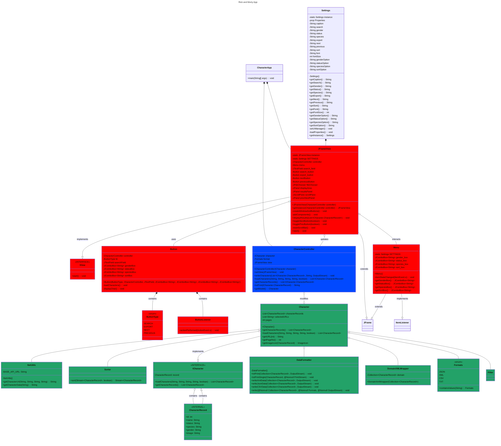

```mermaid
---
title: Rick and Morty App
---
classDiagram
    direction TB
    class CharacterApp{
        +main(String[] args): void
    }
    
    class Settings {
        -static Settings instance
        -prop Properties 
        -String caption
        -String search
        -String gender
        -String status
        -String species
        -String export
        -String next
        -String previous
        -String sort
        -String font
        -int fontSize
        -String genderOption
        -String statusOption
        -String speciesOption
        -String sortOption
        -Settings()
        +getCaption(): String
        +getSearch(): String
        +getGender(): String
        +getStatus(): String
        +getSpecies(): String
        +getExport(): String
        +getNext(): String
        +getPrevious(): String
        +getSort(): String
        +getFont(): String
        +getFontSize(): int
        +getGenderOption(): String
        +getStatusOption(): String
        +getSpeciesOption(): String
        +getSortOption(): String
        -setUIManager(): void
        -loadProperties(): void
        +getInstance(): Settings            
    }
    
    class JFrameView{
        -static JFrameView instance
        -static Settings SETTINGS
        -CharacterController controller
        -Menu menu
        -JTextField search_field
        -Button search_button
        -Button export_button
        -Button nextButton
        -Button previousButton
        -JFileChooser fileChooser
        -JPanel displayArea
        -JPanel resultsPanel
        -JScrollPane scrollPane
        -JPanel prevNextPanel
        +JFrameView(CharacterController controller)
        +getInstance(CharacterController controller): JFrameView
        -createWindowAndButtons(): void
        -addComponents(): void
        +displayResults(List~ICharacter.CharacterRecord~): void
        +toggleNextButton(boolean): void
        +togglePrevButton(boolean): void
        -resetScrollBar(): void
        +start(): void      
    }

    class IView{
        <<INTERFACE>>
        +start(): void
    }
    
    class Menu {
        -static Settings SETTINGS
        -JComboBox~String~ gender_box
        -JComboBox~String~ status_box
        -JComboBox~String~ species_box
        -JComboBox~String~ sort_box
        +Menu()
        +itemStateChanged(ItemEvent e): void
        +getGenderBox(): JComboBox~String~
        +getStatusBox(): JComboBox~String~
        +getSpeciesBox(): JComboBox~String~
        +getSortBox(): JComboBox~String~
    }


    class Button {
        -CharacterController controller
        -ButtonType bt
        -JTextField searchField
        -JComboBox~String~ genderBox
        -JComboBox~String~ statusBox
        -JComboBox~String~ speciesBox
        -JComboBox~String~ sortBox
        +Button(ButtonType, CharacterController, JTextField, JComboBox~String~, JComboBox~String~, JComboBox~String~, JComboBox~String~)
        -loadCharacters(): void
        -displayChar(): void
    }    
    
    class ButtonType {
        <<enum>>      
        SEARCH
        EXPORT
        NEXT
        PREVIOUS
    }
    
    class ButtonListener {
        +actionPerformed(ActionEvent e): void
    }

    
    class NetUtils{
        -BASE_API_URL: String
        -NetUtils()
        +getCharacterUrl(String, String, String, String): String
        +getCharacterData(String): String
    }
    
    class Sorter{
        +sort(Stream~CharacterRecord~, boolean): Stream~CharacterRecord~      
    }
    
    class Character{
        -List~CharacterRecord~ characterRecords
        -List~String~ selectedURLs
        -int pages
        +Character()
        +getCharacterRecords(): List~CharacterRecord~
        +loadCharacters(String, String, String, String, boolean): List~CharacterRecord~
        +getURL(int): String
        +getPageNo(): int
        +getImageIcon(CharacterRecord): ImageIcon
    }
    
    Character --|> ICharacter: implements
    class ICharacter{
        <<INTERFACE>>
        CharacterRecord: record
        +loadCharacters(String, String, String, String, boolean): List~CharacterRecord~
        +getCharacterRecords(): List~CharacterRecord~
    }
    
    class DataFormatter{
        -DataFormatter()
        +txtPrint(Collection~CharacterRecord~, OutputStream) : void
        +txtPrintSingle(CharacterRecord, @Nonnull PrintStream) : void
        +writeXmlData(Collection~CharacterRecord~, OutputStream) : void
        +writeJsonData(Collection~CharacterRecord~, OutputStream) : void
        +writeCSVData(Collection~CharacterRecord~, OutputStream) : void
        +write(@Nonnull Collection~CharacterRecord~, @Nonnull Formats, @Nonnull OutputStream) : void
    }
    
    class DomainXMLWrapper{
        -Collection~CharacterRecord~ domain
        +DomainXmlWrapper(Collection~CharacterRecord~)
    }
    
    class Formats{
        <<enum>>
        JSON
        XML
        CSV
        TXT
        +containsValues(String): Formats    
    }
    
    class CharacterController{
        -ICharacter character
        -Formats format
        -JFrameView view
        +CharacterController(ICharacter character)
        +setView(JFrameView): void
        +writeCharacters(List~ICharacter.CharacterRecord~, String, OutputStream): void
        +loadCharacters(String, String, String, String, boolean): List~ICharacter.CharacterRecord~
        +getCharacterRecords(): List~ICharacter.CharacterRecord~
        +txtPrint(ICharacter.CharacterRecord): String
        +getModel(): Character
    }
    
    class CharacterRecord{
        <<INTERNAL>>
        +id: int
        +name: String
        +status: String
        +species: String
        +gender: String
        +image: String
    }
    
    ICharacter o-- CharacterRecord: contains
    CharacterApp *-- JFrameView
    Settings *-- JFrameView
    CharacterApp *-- CharacterController
    
    JFrameView o-- CharacterController: updates
    JFrameView o-- Menu: interacts
    JFrameView o-- Button: uses  
    JFrameView --|> JFrame: extends
    JFrameView --|> IView: implements
    Menu --|> JFrame: extends
    Menu --|> ItemListener: implements
    
    Button *-- ButtonListener: contains
    Button *-- ButtonType: contains
    
    CharacterController o--o Character: modifies
    Character o-- Filter
    Character o-- DataFormatter
    Character o-- DomainXMLWrapper
    Character o-- NetUtils
    Character o-- Sorter
    Character o-- Formats
    ICharacter <|-- CharacterRecord: contains

    style DataFormatter fill:#23A268
    style CharacterRecord fill:#23A268
    style DomainXMLWrapper fill:#23A268
    style Formats fill:#23A268
    style NetUtils fill:#23A268
    style Sorter fill:#23A268
    style Character fill:#23A268
    style Filter fill:#23A268
    style ICharacter fill:#23A268
    
    style JFrameView fill: #FF0101
    style IView fill: #FF0101
    style Menu fill: #FF0101
    style Button fill: #FF0101
    style ButtonType fill: #FF0101
    style ButtonListener fill: #FF0101

    
    style CharacterController fill:#0149FF


```
