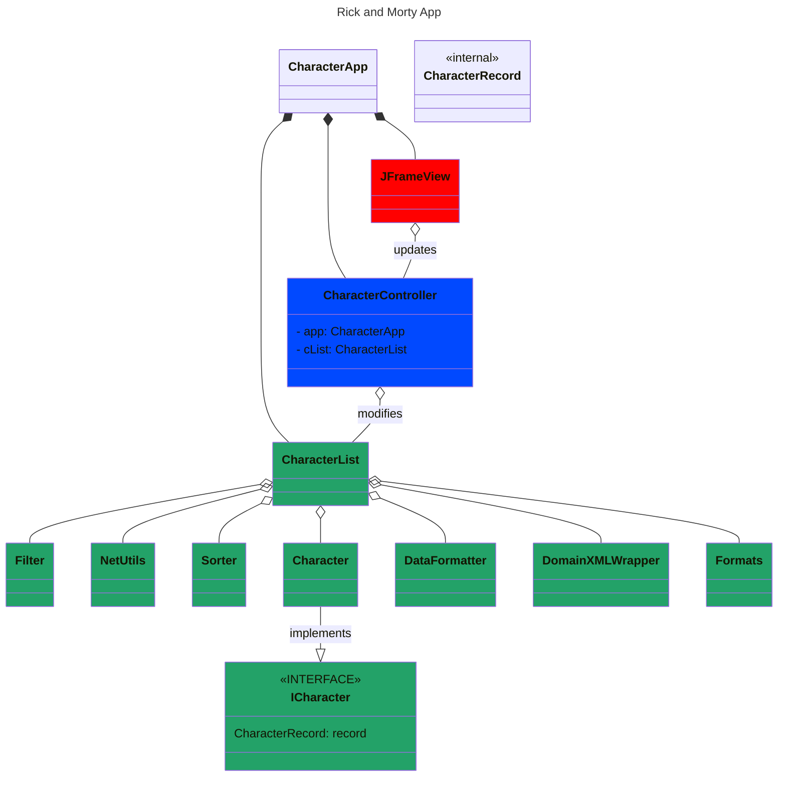

```mermaid
---
title: Rick and Morty App
---
classDiagram
    direction TB
    class CharacterApp{
 }
    class JFrameView{
        
 }
    class Filter{
        
    }
    class NetUtils{
        
    }
    class Sorter{
        
    }
    class Character{
        
    }
    Character --|> ICharacter: implements
    class ICharacter{
        <<INTERFACE>>
        CharacterRecord: record
    }
    class DataFormatter{
        
    }
    class DomainXMLWrapper{
        
    }
    class Formats{
        
    }
    class CharacterController{
         - app: CharacterApp
         - cList: CharacterList
    }
    class CharacterRecord{
        <<internal>>
    }
    CharacterApp *-- JFrameView
    CharacterApp *-- CharacterController
    CharacterApp *-- CharacterList
    JFrameView o-- CharacterController: updates
    CharacterController o-- CharacterList: modifies
    CharacterList o-- Character
    CharacterList o-- Filter
    CharacterList o-- DataFormatter
    CharacterList o-- DomainXMLWrapper
    CharacterList o-- NetUtils
    CharacterList o-- Sorter
    CharacterList o-- Formats
    

    style DataFormatter fill:#23A268
    style CharacterList fill:#23A268
    style DomainXMLWrapper fill:#23A268
    style Formats fill:#23A268
    style NetUtils fill:#23A268
    style Sorter fill:#23A268
    style Character fill:#23A268
    style Filter fill:#23A268
    style ICharacter fill:#23A268
    style JFrameView fill: #FF0101
    style CharacterController fill:#0149FF


```
